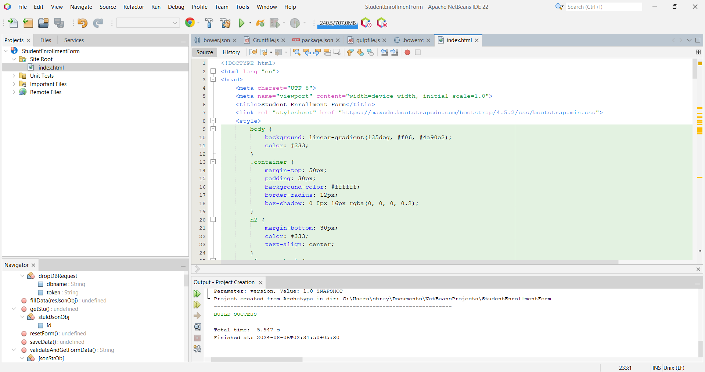

# JsonPowerDB_Login2Xplore
The Student Enrollment Form is a web app built with HTML, JavaScript, and JsonPowerDB. It enables users to add, update, and reset student records with ease. Featuring a clean design and efficient data handling, it's perfect for educational institutions managing student information.

## Student Enrollment Form

### Description
The Student Enrollment Form is a web application designed to manage student records. Built using HTML, JavaScript, and JsonPowerDB, it allows users to add, update, and reset student data efficiently. The application interacts with JsonPowerDB to handle database operations, making it an ideal solution for managing student information in educational institutions.

### Benefits of Using JsonPowerDB
JsonPowerDB is an optimal choice for this project due to the following benefits:
- **High Performance**: JsonPowerDB offers fast read and write operations, which is crucial for applications with large datasets.
- **Ease of Use**: The straightforward API simplifies CRUD operations, reducing development time and effort.
- **Flexibility**: JsonPowerDB supports a variety of JSON data operations, allowing for easy data manipulation.
- **Scalability**: It is designed to handle growing data volumes efficiently, ensuring that the application remains responsive.

### Release History
- **v1.0** (2024-08-06): Initial release featuring basic functionalities for managing student records using JsonPowerDB.

For detailed code and version history, visit the [GitHub repository](https://github.com/verma094/JsonPOwerDB_Login2Xplore).

### Live Hosting
You can access the live version of the Student Enrollment Form at [this link](https://json-p-ower-db-login2-xplore.vercel.app/).

## Table of Contents
1. [Screenshots](#screenshots)
2. [Scope of Functionalities](#scope-of-functionalities)
3. [Examples of Use](#examples-of-use)
4. [Project Status](#project-status)
5. [Sources](#sources)
6. [Other Information](#other-information)

## Screenshots

### 1. Form Layout

*Description: The main layout of the Student Enrollment Form, including fields for Roll-No, Full Name, Class, Birth Date, Address, and Enrollment Date.*

### 2. Form Layout for Second Record

*Description: Example of the form layout when a second record is entered, showing the updated fields.*

### 3. Save and Update Button Functionality

*Description: Interface showing the form with Save and Update buttons, demonstrating their functionality.*

### 4. JSON PowerDB Page

*Description: View of the JSON PowerDB page where the database interactions occur.*

### 5. Visualize in JSON PowerDB Page

*Description: Visualization of data within JSON PowerDB, showing how data is displayed.*

### 6. Token Key in JSON PowerDB Page

*Description: Example of the token key used for authentication and database access in JSON PowerDB.*

### 7. Code Snippet in NetBeans Page

*Description: A snippet of code from NetBeans demonstrating how the Student Enrollment Form is implemented.*

## Scope of Functionalities
The Student Enrollment Form includes the following functionalities:
- **Save Data**: Adds new student records to the JsonPowerDB database. Ensures that all required fields are filled before saving.
- **Update Data**: Updates existing student records based on Roll-No. Automatically fills the form with existing data when Roll-No is provided.
- **Reset Form**: Clears all input fields in the form, allowing users to start fresh with a new record entry.
- **Drop Database**: (Optional) Functionality to drop the existing database, useful for resetting or clearing all records.

## Examples of Use

### Save Data
1. Enter student details in the respective fields: Roll-No, Full Name, Class, Birth Date, Address, and Enrollment Date.
2. Click the "Save" button to store the record in the JsonPowerDB database. Ensure all fields are filled to avoid validation errors.

### Update Data
1. Enter the Roll-No of the student you wish to update. If the Roll-No exists, the form will populate with existing data.
2. Modify the fields as needed.
3. Click the "Update" button to save the changes to the database.

### Reset Form
1. Click the "Reset" button to clear all input fields in the form. This prepares the form for a new data entry.

## Project Status
The project is currently in its initial release phase. Planned future updates include:
- Enhanced user interface improvements.
- Additional functionalities based on user feedback.
- Integration of advanced validation mechanisms.

## Sources
- [JsonPowerDB Documentation](http://login2explore.com/jpdb/docs.html#jpdb-command-request)
- [Bootstrap Documentation](https://getbootstrap.com/docs/4.5/getting-started/introduction/)
- [jQuery Documentation](https://jquery.com/)

## Other Information
For additional details, feature requests, or issues, please visit the [GitHub repository](https://github.com/verma094/JsonPOwerDB_Login2Xplore/issues). Contributions and feedback are welcome.

---

**Note:** To ensure the application works correctly, make sure that the JsonPowerDB API key and database configurations are correctly set. Adjust the API endpoints and parameters according to your specific setup.
